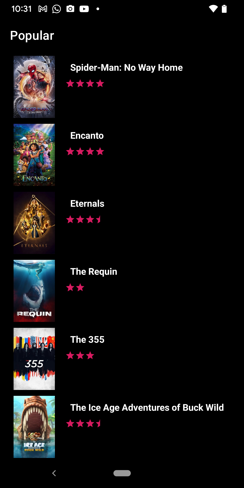
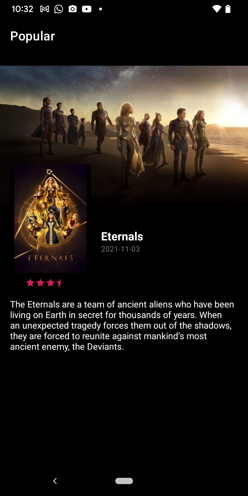

App Architecture
===================

Application uses the free [TMDB API](https://developers.themoviedb.org/3)
for Querying to provide information on popular Movie which will display as list.
OnClicking of an item detail Page will be loaded.

1. App is designed with MVVM architecture
2. Data is fetched from TMDB API using Retrofit.
3. Dagger2 has been used wherever dependencies are required.
4. Use of coroutines for fetching data.
5. Data is displayed on the UI using livedata.
6. Images are loaded using Glide.
7. Databinding is been used for binding.

Screenshot
----------

